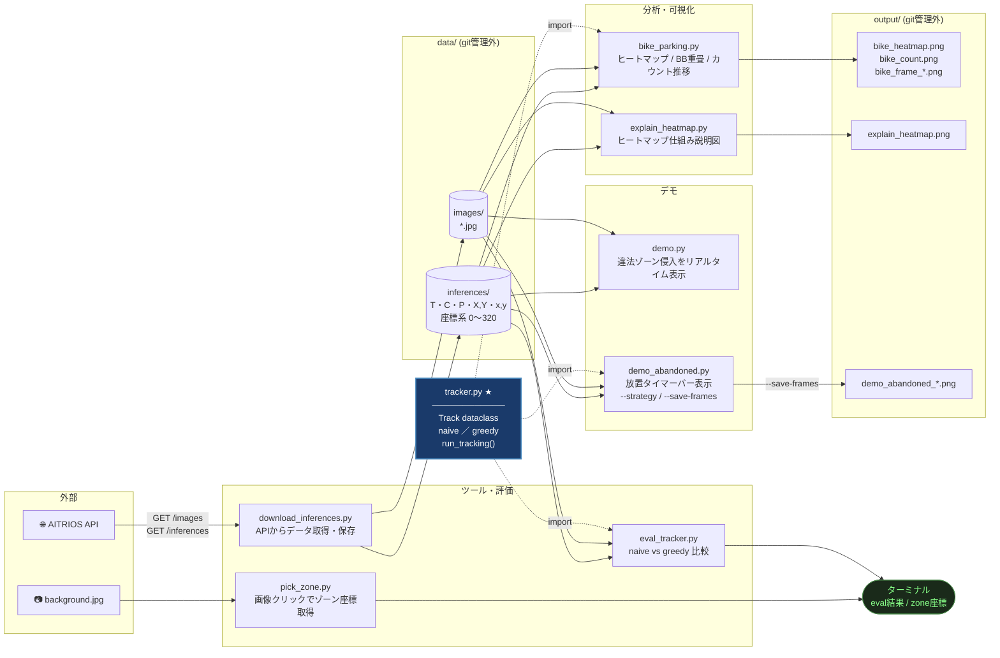
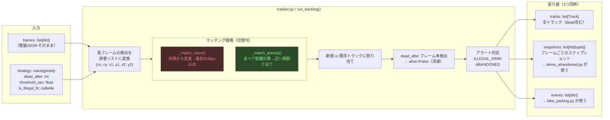
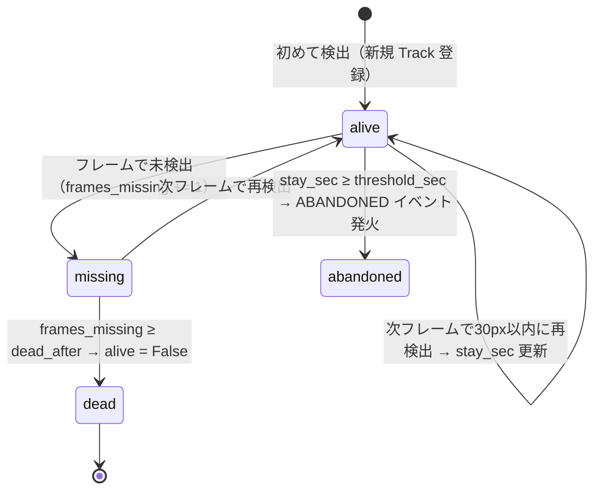

# Mermaid 図集（最新版）

## 図1: scripts/ 全体のデータフロー

```mermaid
flowchart LR
    subgraph SRC["外部"]
        direction TB
        API["🌐 AITRIOS API"]
        BG["📷 background.jpg"]
    end

    subgraph STORE["data/  (git管理外)"]
        direction TB
        IMG[("images/\n*.jpg")]
        JSON[("inferences/\nT・C・P・X,Y・x,y\n座標系 0〜320")]
    end

    TRK["tracker.py ★\n────────────\nTrack dataclass\nnaive ／ greedy\nrun_tracking()"]

    subgraph ANALYSIS["分析・可視化"]
        direction TB
        BP["bike_parking.py\nヒートマップ / BB重畳 / カウント推移"]
        EXP["explain_heatmap.py\nヒートマップ仕組み説明図"]
    end

    subgraph DEMO["デモ"]
        direction TB
        D["demo.py\n違法ゾーン侵入をリアルタイム表示"]
        DA["demo_abandoned.py\n放置タイマーバー表示\n--strategy / --save-frames"]
    end

    subgraph TOOLS["ツール・評価"]
        direction TB
        DL["download_inferences.py\nAPIからデータ取得・保存"]
        PK["pick_zone.py\n画像クリックでゾーン座標取得"]
        EV["eval_tracker.py\nnaive vs greedy 比較"]
    end

    subgraph OUT["output/  (git管理外)"]
        direction TB
        O1["bike_heatmap.png\nbike_count.png\nbike_frame_*.png"]
        O2["explain_heatmap.png"]
        O3["demo_abandoned_*.png"]
    end

    TERM(["ターミナル\neval結果 / zone座標"])

    API -->|"GET /images\nGET /inferences"| DL
    DL --> IMG & JSON
    BG --> PK --> TERM

    JSON & IMG --> BP & D & DA & EV & EXP

    TRK -.->|import| BP
    TRK -.->|import| DA
    TRK -.->|import| EV

    BP --> O1
    EXP --> O2
    DA -->|"--save-frames"| O3
    EV --> TERM

    style TRK fill:#1a3a6a,color:#fff,stroke:#4a8abf,stroke-width:2px
    style TERM fill:#1a2a1a,color:#8f8,stroke:#4a8a4a
```

---

## 図2: tracker.py 内部の構造

```mermaid
flowchart LR
    subgraph IN["入力"]
        F["frames: list[dict]\n（推論JSON そのまま）"]
        PARAMS["strategy: naive|greedy\ndead_after: int\nthreshold_sec: float\nis_illegal_fn: callable"]
    end

    subgraph TRACKER["tracker.py / run_tracking()"]
        PARSE["各フレームの検出を\n辞書リストに変換\n(cx, cy, x1, y1, x2, y2)"]

        subgraph MATCH["マッチング戦略（切替可）"]
            NAIVE["_match_naive()\n先頭から走査→最初の30px以内"]
            GREEDY["_match_greedy()\n全ペア距離計算→近い順割り当て"]
        end

        ASSIGN["新規 or 既存トラックに割り当て"]
        DEAD["dead_after フレーム未検出\n→ alive=False（消滅）"]
        EVENT["アラート判定\nILLEGAL_PARK\nABANDONED"]
    end

    subgraph OUT["戻り値（3つ同時）"]
        T["tracks: list[Track]\n全トラック（dead含む）"]
        S["snapshots: list[list[tuple]]\nフレームごとのスナップショット\n→ demo_abandoned.py が使う"]
        E["events: list[dict]\n→ bike_parking.py が使う"]
    end

    F & PARAMS --> PARSE --> MATCH --> ASSIGN --> DEAD --> EVENT
    EVENT --> T & S & E

    style GREEDY fill:#2a4a2a,color:#8f8,stroke:#4a7a4a
    style NAIVE  fill:#4a2a2a,color:#f88,stroke:#7a4a4a
```

---

## 図3: Track のライフサイクル

```mermaid
stateDiagram-v2
    [*] --> alive : 初めて検出（新規 Track 登録）
    alive --> alive : 次フレームで30px以内に再検出 → stay_sec 更新
    alive --> missing : フレームで未検出（frames_missing += 1）
    missing --> alive : 次フレームで再検出
    missing --> dead : frames_missing ≥ dead_after → alive = False
    alive --> abandoned : stay_sec ≥ threshold_sec → ABANDONED イベント発火
    dead --> [*]
```
