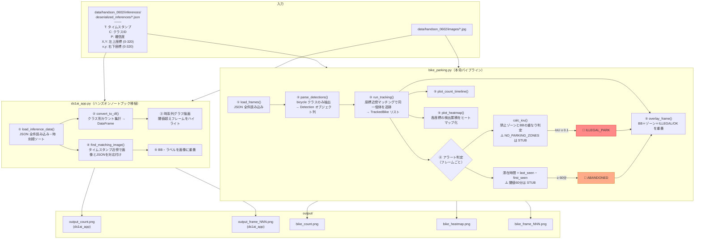
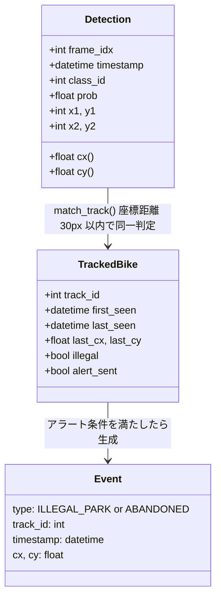
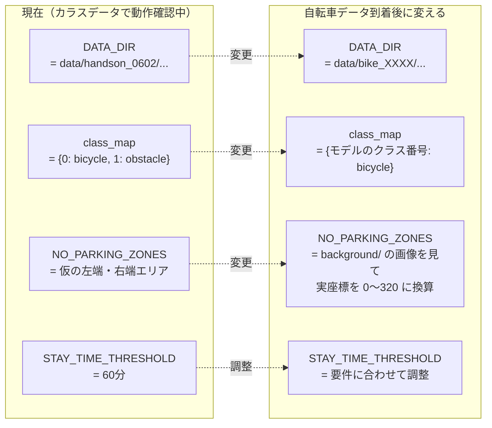

# Mermaid 図集

## 図1: スクリプト全体像

```mermaid
flowchart TB
    subgraph IN["入力"]
        JSON["data/handson_0602/inferences/\ndeserialized_inferences/*.json\n───\nT: タイムスタンプ\nC: クラスID\nP: 確信度\nX,Y: 左上座標 (0-320)\nx,y: 右下座標 (0-320)"]
        IMG["data/handson_0602/images/*.jpg"]
    end

    subgraph DS1["ds1ai_app.py（ハンズオンノートブック移植）"]
        D1["① load_inference_data()\n   JSON 全件読み込み・時刻順ソート"]
        D2["② convert_to_df()\n   クラス別カウント集計 → DataFrame"]
        D3["③ 時系列グラフ描画\n   閾値超えフレームをハイライト"]
        D4["④ find_matching_image()\n   タイムスタンプ近傍で画像とJSONを対応付け"]
        D5["⑤ BB・ラベルを画像に重畳"]
        D1 --> D2 --> D3
        D1 --> D4 --> D5
    end

    subgraph BK["bike_parking.py（本命パイプライン）"]
        B1["① load_frames()\n   JSON 全件読み込み"]
        B2["② parse_detections()\n   bicycle クラスのみ抽出\n   → Detection オブジェクト列"]
        B3["③ run_tracking()\n   座標近傍マッチングで同一個体を追跡\n   → TrackedBike リスト"]
        B4{"④ アラート判定\n（フレームごと）"}
        B5["calc_iou()\n禁止ゾーンとBBの重なり判定\n⚠️ NO_PARKING_ZONES は STUB"]
        B6["滞在時間 = last_seen − first_seen\n⚠️ 閾値60分は STUB"]
        B7["⑤ plot_count_timeline()"]
        B8["⑤ plot_heatmap()\n各座標の検出累積をヒートマップ化"]
        B9["⑤ overlay_frame()\nBB＋ゾーン＋ILLEGAL/OK を重畳"]
        B1 --> B2 --> B3 --> B4
        B4 --> B5 -->|"IoU ≥ 0.1"| ILLEGAL["🚨 ILLEGAL_PARK"]
        B4 --> B6 -->|"≥ 60分"| ABANDON["🚨 ABANDONED"]
        B3 --> B7
        B3 --> B8
        B3 & ILLEGAL & ABANDON --> B9
    end

    subgraph OUT["output/"]
        O1["output_count.png\n(ds1ai_app)"]
        O2["output_frame_NNN.png\n(ds1ai_app)"]
        O3["bike_count.png"]
        O4["bike_heatmap.png"]
        O5["bike_frame_NNN.png"]
    end

    JSON --> DS1 --> O1 & O2
    IMG  --> DS1
    JSON --> BK  --> O3 & O4 & O5
    IMG  --> BK

    style ILLEGAL fill:#f88,stroke:#c00
    style ABANDON  fill:#fa8,stroke:#c60
```

---

## 図2: bike_parking.py のデータ構造

```mermaid
classDiagram
    class Detection {
        +int frame_idx
        +datetime timestamp
        +int class_id
        +float prob
        +int x1, y1
        +int x2, y2
        +float cx()
        +float cy()
    }

    class TrackedBike {
        +int track_id
        +datetime first_seen
        +datetime last_seen
        +float last_cx, last_cy
        +bool illegal
        +bool alert_sent
    }

    class Event {
        type: ILLEGAL_PARK or ABANDONED
        track_id: int
        timestamp: datetime
        cx, cy: float
    }

    Detection --> TrackedBike : match_track() 座標距離 30px 以内で同一判定
    TrackedBike --> Event : アラート条件を満たしたら生成
```

---

## 図3: STUB（自転車データが来たら変えるところ）

```mermaid
flowchart LR
    subgraph NOW["現在（カラスデータで動作確認中）"]
        S1["DATA_DIR\n= data/handson_0602/..."]
        S2["class_map\n= {0: bicycle, 1: obstacle}"]
        S3["NO_PARKING_ZONES\n= 仮の左端・右端エリア"]
        S4["STAY_TIME_THRESHOLD\n= 60分"]
    end

    subgraph REAL["自転車データ到着後に変える"]
        R1["DATA_DIR\n= data/bike_XXXX/..."]
        R2["class_map\n= {モデルのクラス番号: bicycle}"]
        R3["NO_PARKING_ZONES\n= background/ の画像を見て\n実座標を 0〜320 に換算"]
        R4["STAY_TIME_THRESHOLD\n= 要件に合わせて調整"]
    end

    S1 -.->|変更| R1
    S2 -.->|変更| R2
    S3 -.->|変更| R3
    S4 -.->|調整| R4
```
