## 駐輪場の現状と課題について

令和3年10月6日(水)

熊本市自転車駐車対策等協議会

### 1.市営駐輪場の整備状況

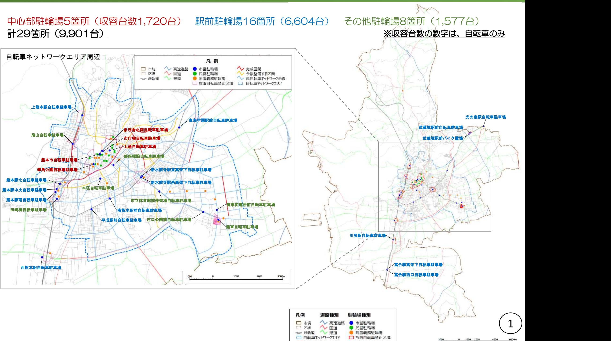

### 2.「駐輪環境の整備・構築」に向けて(熊本市自転車活用推進計画より)

○推進計画では「駐輪環境の整備・構築」を施策として掲げており、 施策の推進に向けて各駐輪場の調査を実施。

【熊本市自転車活用推進計画(R3.3)より】

| 施策            | 取組                      |
|---------------|-------------------------|
| 1. 自転車走行空間の整備 | ①自転車走行空間の整備             |
|               | ②交通事故危険箇所における事故防止対策     |
|               | ③自転車ネットワークの拡充           |
| 2. 駐輪環境の整備・構築 | ①交通結節点等における駐輪場整備        |
|               | ②放置自転車ゼロ作戦              |
|               | ③駐輪場整備補助の導入             |
|               | ④駐輪場の有料化・料金体系の見直し       |
|               | ⑤駐輪場設備の拡充および施設の更新       |
|               | ⑥駐輪場のICカードへの対応化         |
| 3. 自転車通勤の促進   | ①熊本市版「自転車通勤推進企業」認定制度の導入 |
|               | ②サイクル&ライドの促進            |

本年度 各駐輪場の 調査を実施

### 3-1.市営駐輪場の課題

### 駐輪場の確保・適正配置

- ・民営駐輪場が撤退し、中心部の駐輪場が大幅に減少している。
- ・新市街や上通で民間駐輪場が撤退し、駐輪場がないエリアが発生。
- ・附置義務駐輪場が増加しているものの、施設利用者以外は自由に利用できないという制約がある。

放置自転車ゼロ作戦(H24.6~)の開始前は、路上駐 輪場や仮設駐輪場により収容台数を確保していたが、 放置自転車が中心部のいたるところで発生していた。

駐車場開設やホテル建設など、別の用途への転用に より、駐輪場が不足しているエリアがみられる。

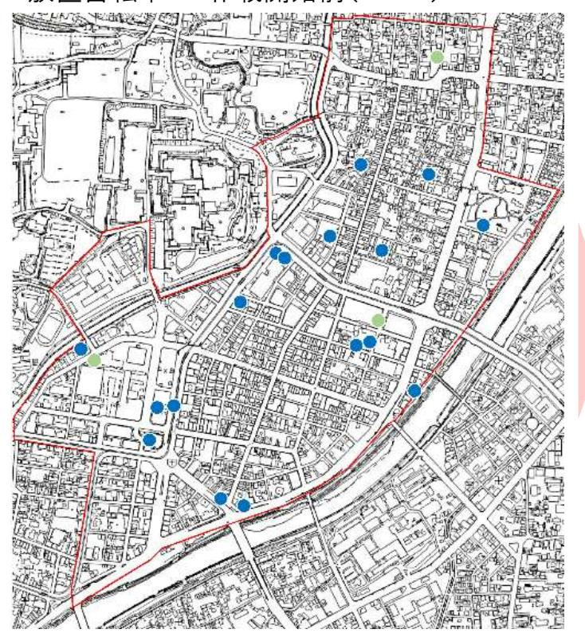

放置自転車ゼロ作戦開始前(H23.3) 放置自転車ゼロ作戦開始後(H24.3) 現在(R2.9)

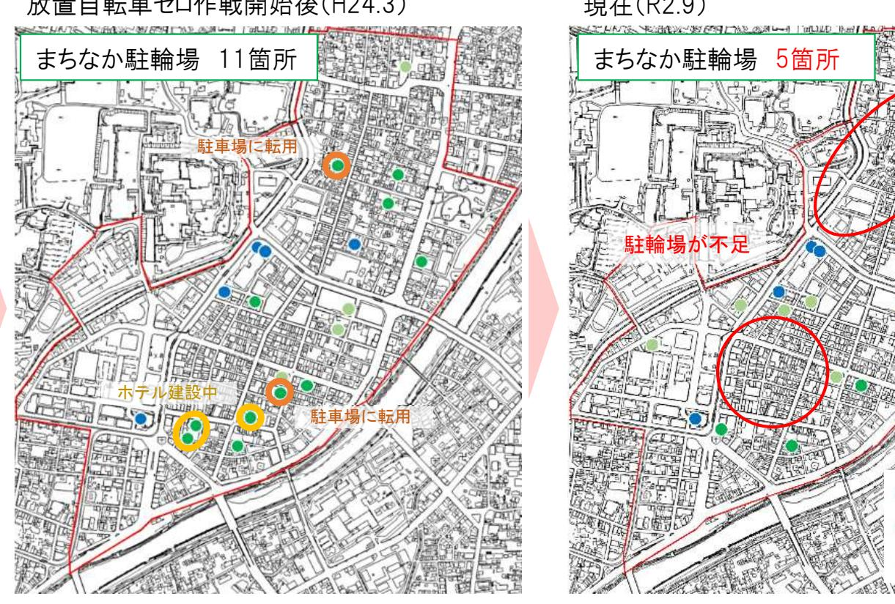

▲中心部の駐輪場の変遷(バイク専用を除く)

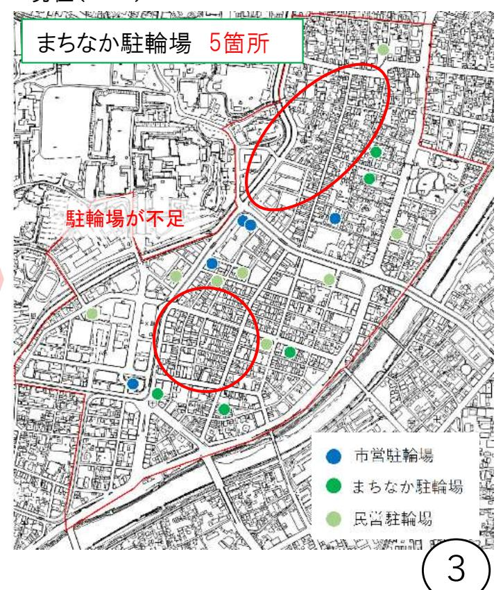

### 3-2.市営駐輪場の課題

### 収容台数の確保

- ・駅前駐輪場では、学生の留め置き自転車が多く、収容台数の確保が必要な駐輪場がある。
- ・駐輪ラックがない駐輪場では、整列駐輪ができず、容量不足の原因となっている。

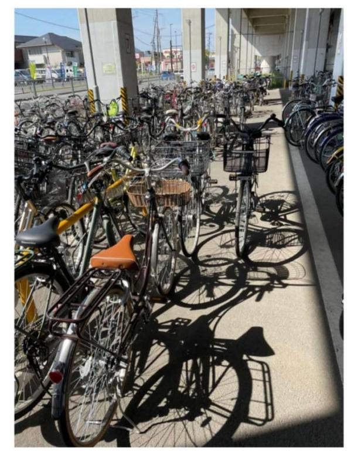

▲収容台数を超え、通路に駐輪されている状況 (西熊本駅)

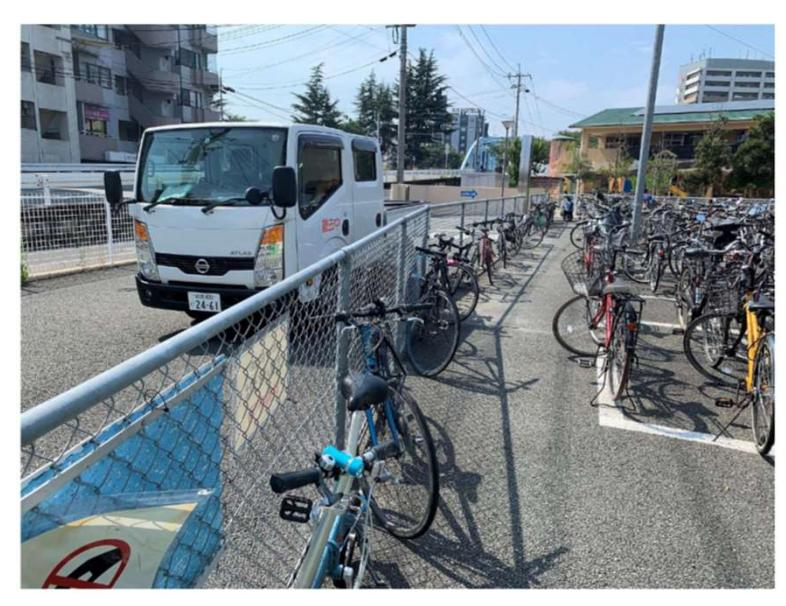

▲収容台数を超え、通路に駐輪されている状況 (銀座橋際)

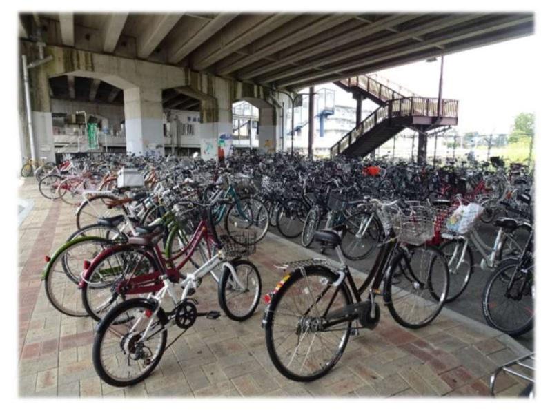

▲乱雑に駐輪されている状況 (平成駅前)

### 3-3. 市営駐輪場の課題

### 施設利用環境の改善

- ・駐輪場の利用環境についての満足度が低くなっている。(R2年度熊本市自転車利用に関するアンケート調査)
- 屋根やラック等の設備が不十分な駐輪場や、設備の更新が必要な駐輪場がある。

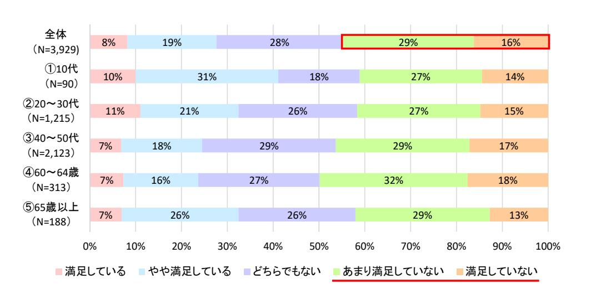

▲駐輪環境の満足度

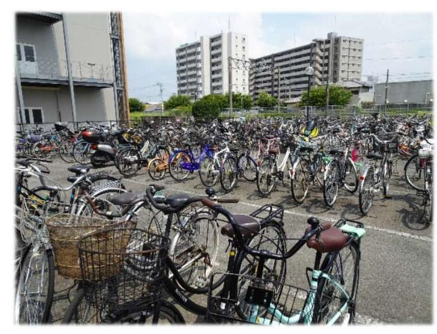

▲屋根が整備されていない駐輪場 (南熊本駅前)

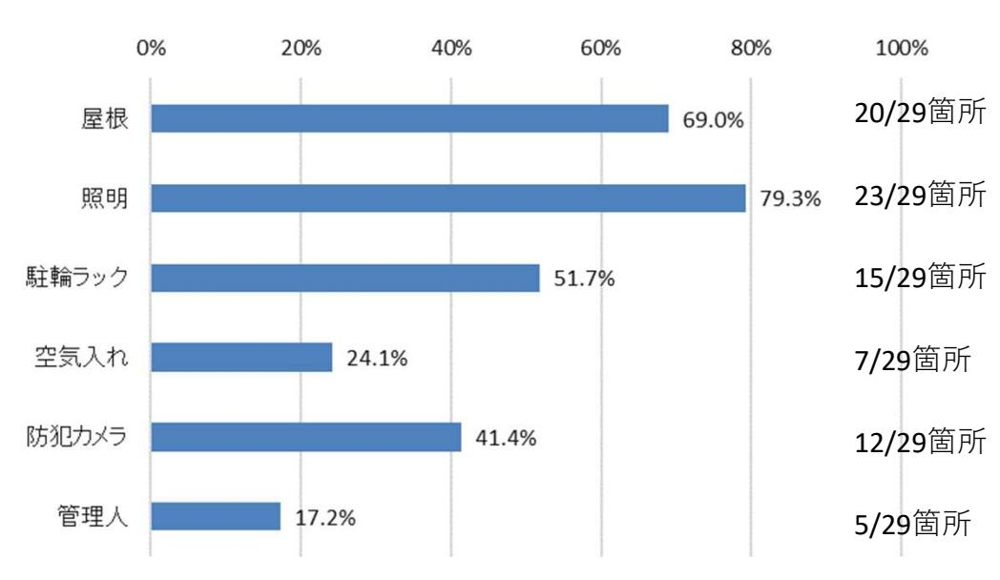

▲市営駐輪場の付帯設備の状況(付帯設備が整備されている駐輪場の割合)

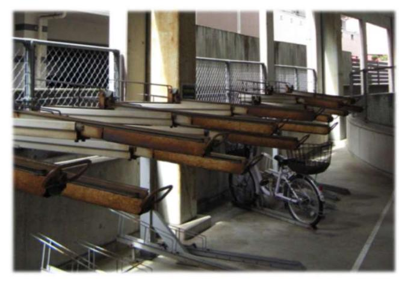

▲故障により使用できない2段ラック (武蔵塚駅前)

### 3-4.市営駐輪場の課題

### 多様化する利用者ニーズへの対応

- ・スタンドのないスポーツバイクやかご付き自転車など、通常の駐輪スペースに駐輪できない車種が増加している。
- ・自転車が高額化する中、自転車施策を展開していくためには、防犯対策を行う必要性がある。

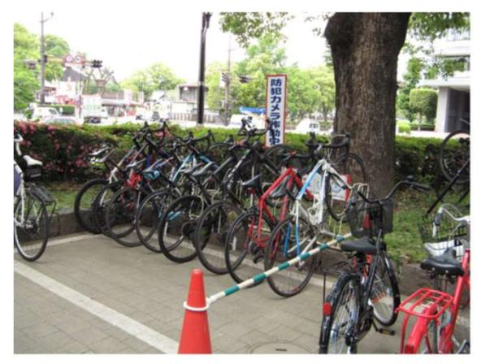

▲スポーツバイク専用区画 (庁舎北側駐輪場)

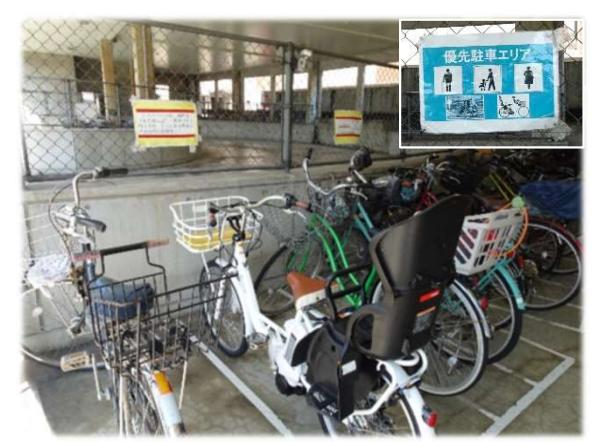

▲その他専用区画 (武蔵塚駅前駐輪場)

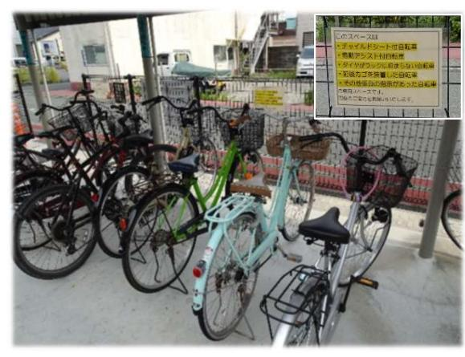

▲その他専用区画 (健軍駐輪場)

### 駐輪マナーの向上

・一部の駐輪場では、区画外に駐輪されている自転車や、長期駐輪の自転車がみられる。

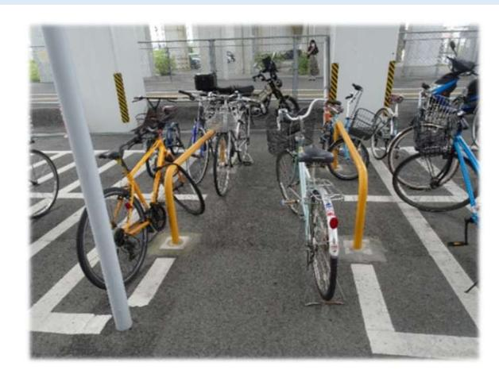

▲通路に駐輪している状況 (富合駅駐輪場)

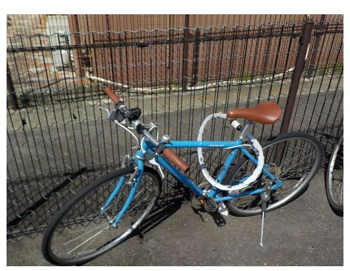

▲フェンスに直接チェーンをつけている (南熊本駅駐輪場)

### 3-5. 市営駐輪場の課題

### 駐輪場の適切な管理・運営

- ・収入が中心部駐輪場に限られ、市全体の駐輪場に関する運営収支は赤字。
- ・維持管理や更新に加え、設備投資等への費用の捻出が厳しい状況。

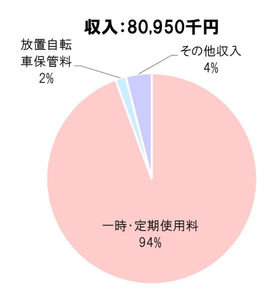

| 一時·定期使用料 放置自転車保管料 | 76,42 4 1,31 - |
|----------------------|-----------------------------------------|
| その他収入                | 3,209                                   |
| 計                    | 80,950                                  |

▲令和2年度収入内訳

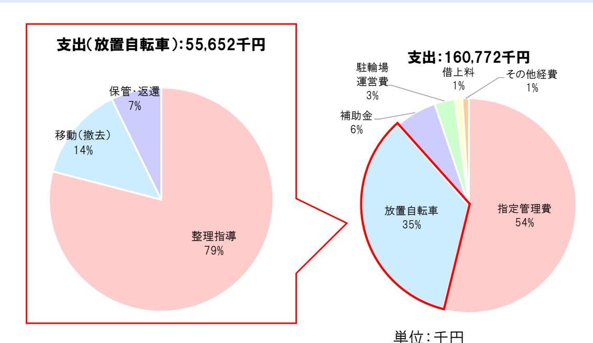

指定管理費 86.688 55.652 放置白転車 整理指導 44,000 移動(撤去) 7,606 保管·返還 4.046 補助金 10.150 駐輪場運営費 4,895 借上料 1.819 その他経費 1.567 計 160.772

▲令和2年度支出内訳

### 駐輪場の調査結果(熊本駅周辺) 4-1.各駐輪場の調査結果(熊本駅周辺)

# 熊本駅自転車駐車場(北・中央・南) [ラック式]

- ○熊本駅は熊本県における鉄道拠点で、バスや市電とも結節しており、公共交通の利用数が 非常に多い駅となっている。
- 〇熊本駅周辺は中心市街地に位置付けられており、周辺に商業施設や企業等が立地している。
- ○駐輪場は収容規模が大きく、利用環境も充実している。(利便性が高い)
- ○駅のコンコースに近い北・中央と比較して南駐輪場の自転車利用台数が非常に少ない。
- ○夜間の学生の留め置きが多い。朝・晩など、一般の方が駐輪しにくい。
- ○大規模なため、他の駐輪場と比較して、運営経費がかかっている。

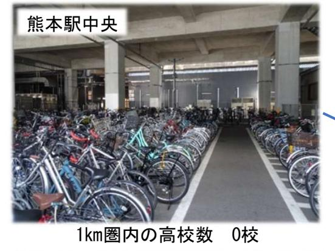

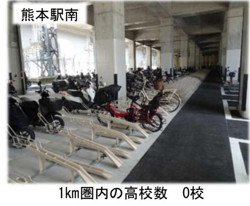

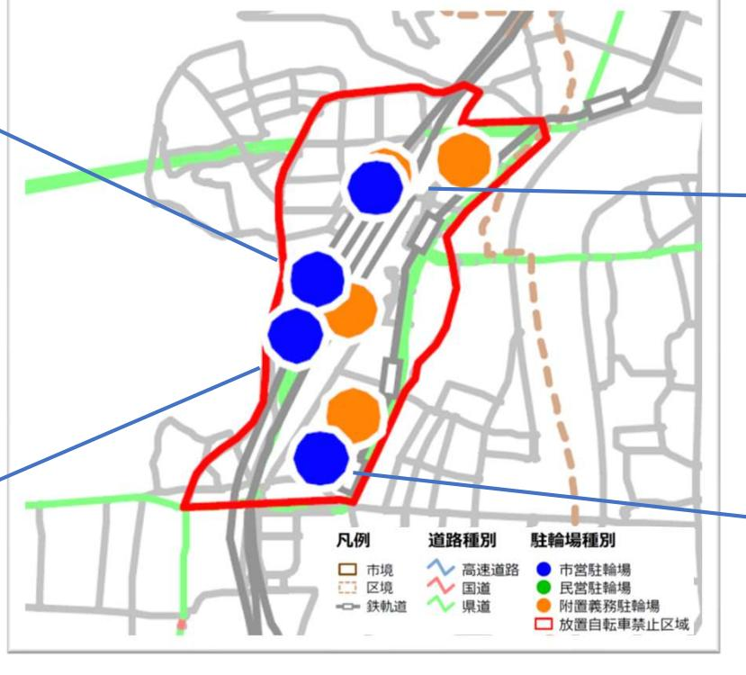

### 田崎橋自転車駐車場[ラック式]

- ○田崎橋電停の乗換駐輪場として、令和3年3月に新設。
- ○屋根や駐輪ラック整備等、利用しやすい環境にある。

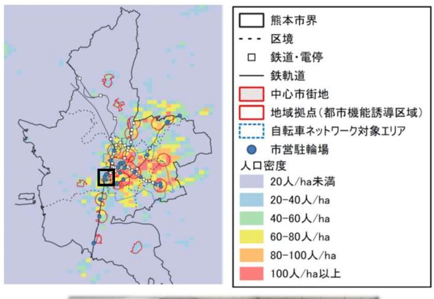

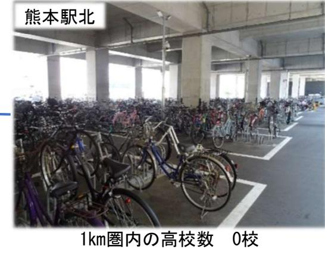

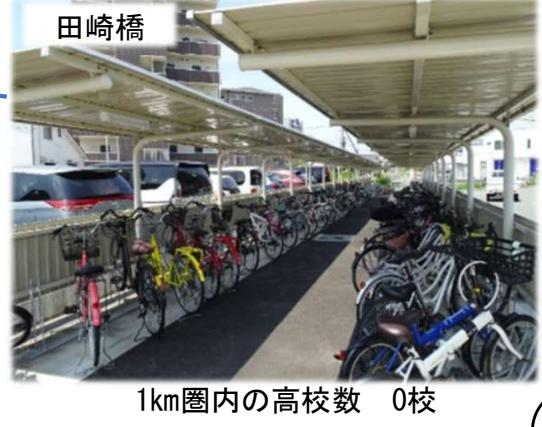

### 4-2.各駐輪場の調査結果(南熊本、平成方面)

### 本荘自転車駐車場[平置き]

○地域拠点外で近くに鉄道駅・電停はなく、利用台数が少ない。

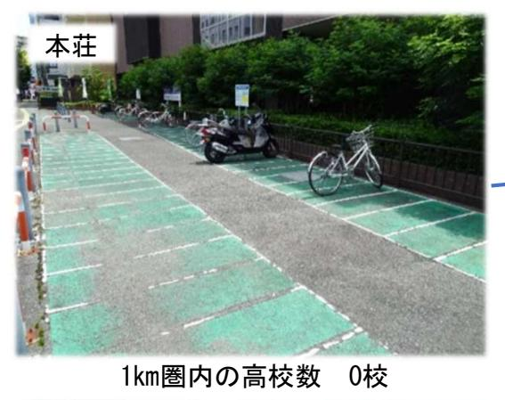

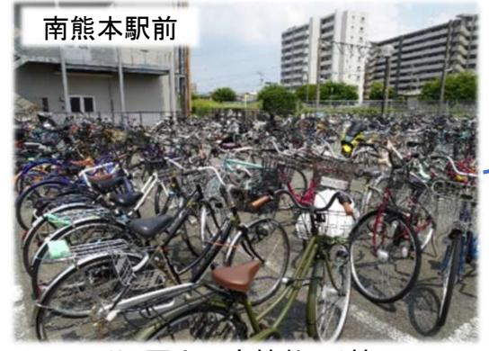

# 1㎞圏内の高校数 0校 1㎞圏内の学校数 0校

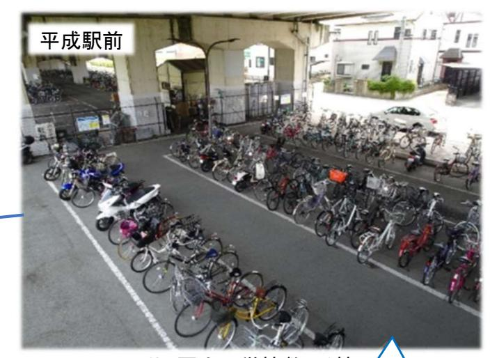

### 平成駅前自転車駐車場[平置き]

- ○地域拠点内に立地し、周辺人口が多い。鉄道駅に隣接している。
- ○駐輪容量を超えており、通路に駐輪している状況。
- ○ラックがないため、乱雑に駐輪されている状況にある。

### 南熊本駅前自転車駐車場[平置き]

- ○地域拠点内に立地し、周辺人口が多い。鉄道駅に隣接している。
- ○利用は多いが、屋根、ラックは整備されていない。

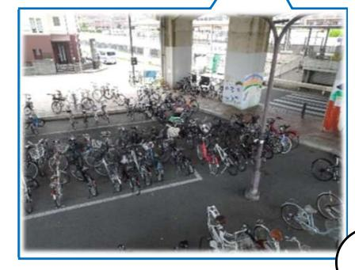

### 4-3.各駐輪場の調査結果(銀座橋、水前寺方面)

### 銀座橋際自転車駐車場[平置き]

- ○中心部に近い無料駐輪場であり、通勤利用者が多い。
- 〇原付の駐輪が多い。
- ○駐輪容量を超えており、通路に駐輪されている自転車がみられる。
- ○利用は多いが、屋根、ラックは整備されていない。

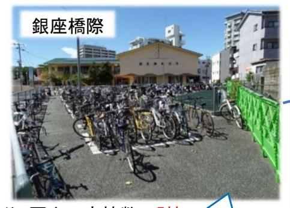

1㎞圏内の高校数 5校

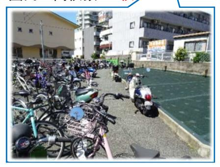

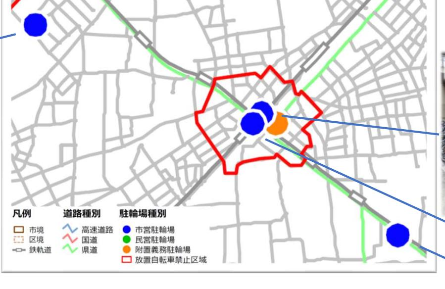

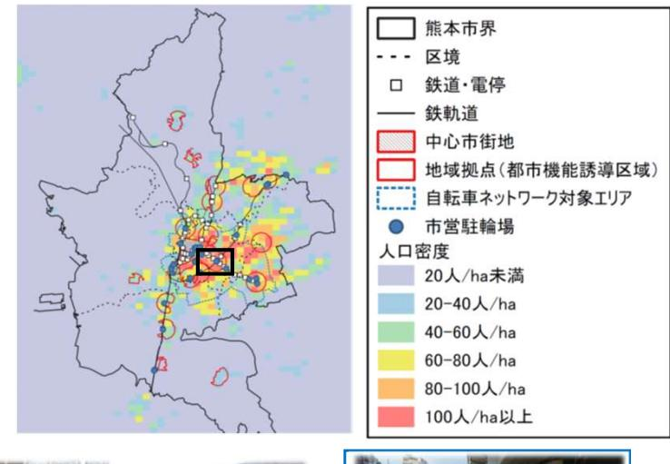

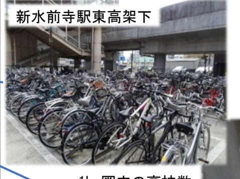

1㎞圏内の高校数 8校

### 新水前寺駅西高架下

### 新水前寺駅自転車駐車場(東高架下・西高架下)[ラック式]

- ○地域拠点内に立地し、かつ鉄道駅・電停の乗換拠点であり、周辺人口、周辺の施設や学校も多い。 ○学生の留め置きが多く、駐輪容量を超え、通路に駐輪されている自転車がみられる。
- 〇朝夕に整理員を投入して、駐輪場所を確保している状況。

### 市立体育館前電停自転車駐車場[平置き]

- ○電停に隣接し、周辺人口は多いものの、利用が少ない。
- ○屋根、ラックは整備されていない。

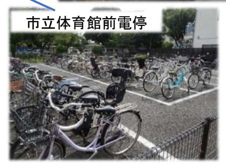

1㎞圏内の高校数 3校

### 4-4.各駐輪場の調査結果(上熊本方面)

### 上熊本駅自転車駐車場[ラック式]

- ○地域拠点内に立地し、かつ鉄道駅・電停に隣接している。
- 〇駐輪場は収容規模が大きく、利用台数も多い。
- ○駐輪場は近年整備しており、屋根や駐輪ラック等、利用しやすい環境にある。

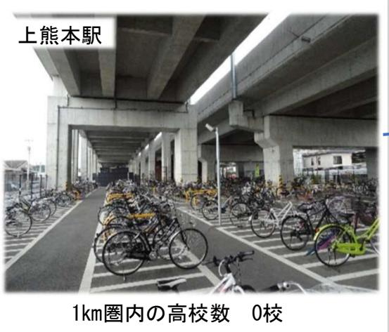

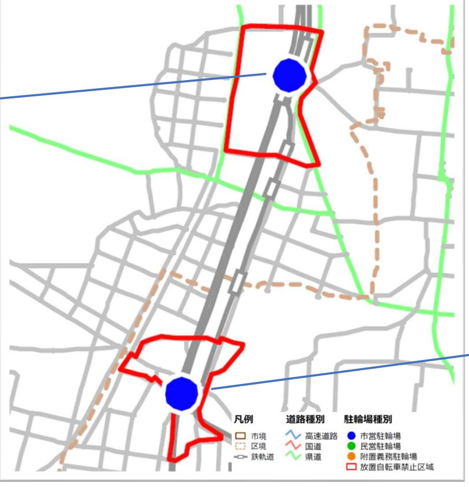

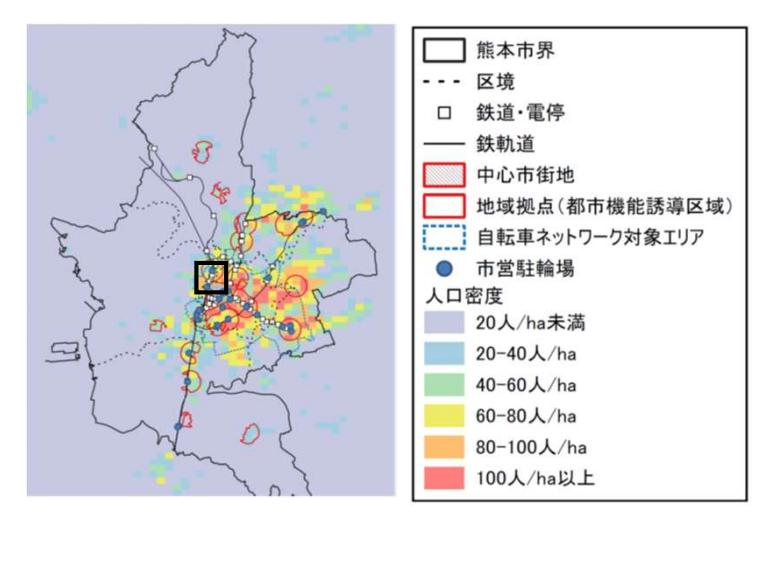

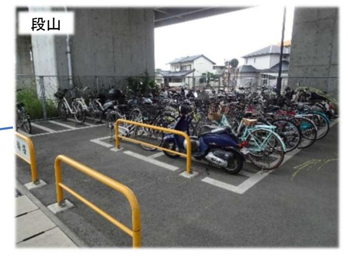

1㎞圏内の高校数 2校

### 段山自転車駐車場[平置き]

- ○段山電停の乗換用駐輪場として整備するが、収容規模が小さい。
- ○ラックは整備されていないが、高架下で雨除けはできる。

### 4-5.各駐輪場の調査結果(西熊本駅、川尻駅、富合駅)

### 西熊本駅自転車駐車場[ラック式]

- ○地域拠点内に立地し、鉄道駅に隣接している。
- ○学生の留め置きが多く、駐輪容量を超え、通路に駐輪されている自転車がある。
- ○ラックがない区画では、乱雑に駐輪されている状況。
- 〇朝夕に整理員を投入して、駐輪場所を確保している状況。

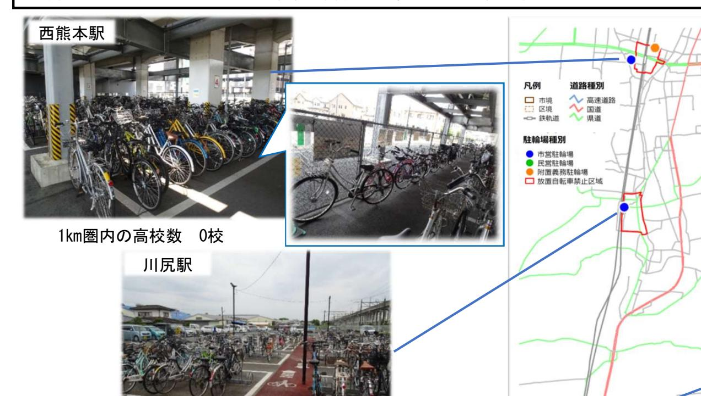

富合駅(高架下)

1㎞圏内の高校数 0校

1㎞圏内の高校数 0校

富合駅(西口(路上))

川尻駅自転車駐車場[ラック式]

- ○地域拠点内に立地し、鉄道駅に隣接している。
- 〇周辺人口、周辺の施設や学校は少ない。
- ○屋根、ラックは整備されていない。

### 富合駅自転車駐車場(高架下・西口(路上))[ラック式(路上平置き)]

1㎞圏内の高校数 0校

○鉄道駅に隣接しているものの、地域拠点(富合)から離れており、周辺人口、周辺の施設や学校も少ない。 ○通路に駐輪されている自転車がある。

### 4-6.各駐輪場の調査結果(武蔵塚方面)

### 武蔵塚駅前自転車駐車場[2段ラック式]・バイク置き場[平置き]

- ○地域拠点内に立地し、鉄道駅に隣接している。
- 〇駐輪場は収容規模(4階建)が大きく、利用台数も多い。
- ○指定管理制度を導入しているため、サービスは充実している。
- ○開設から26年が経過し、建物を含め、老朽化が著しい。
- ○バイク置き場の老朽化も著しく、屋根の更新等が必要となっている。

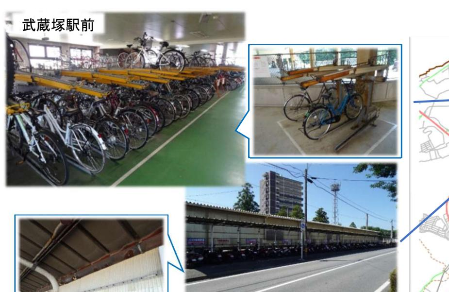

1㎞圏内の高校数 0校

# 光の森駅

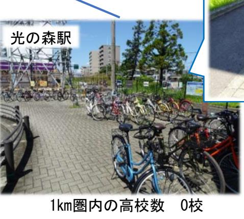

### 光の森駅自転車駐車場[平置き]

○鉄道駅に隣接しているものの、利用台数が少なく、周辺人口、周辺の施設や学校も少ない。

武蔵塚駅前バイク置き場

○屋根、ラックは整備はなく、乱雑に駐輪されている状況がみられる。

### 東海学園駅前自転車駐車場[平置き]

- ○JRへの乗り換え利用が多いが、駐輪場は駅から遠い位置にある。
- ○借地であり、駐輪場の運営が不安定な状況。

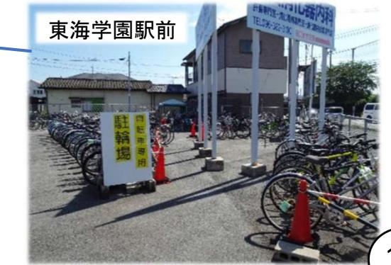

1㎞圏内の高校数 1校

13

### 4-7.各駐輪場の調査結果(健軍方面)

### 庄口公園前自転車駐車場[平置き]

- ○市電電停に隣接している。
- ○収容台数が少ないため、自転車の占有率は高い。
- ○ラック外や通路に駐輪されている自転車がみられる。

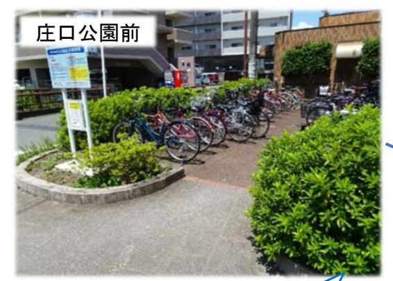

1㎞圏内の高校数 1校

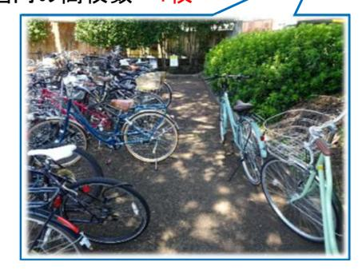

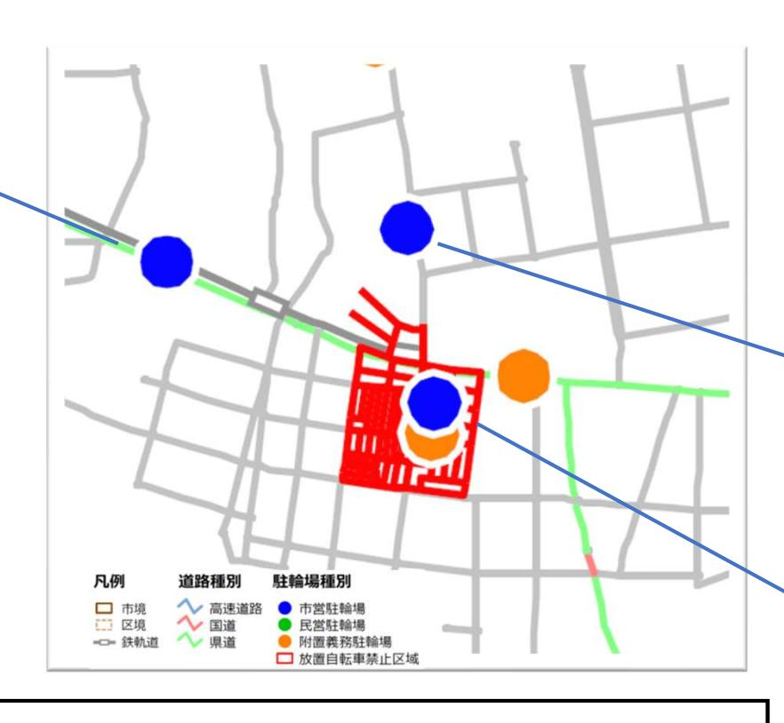

### 健軍変電所前自転車駐車場[平置き]

- ○地域拠点内に立地しているが、健軍電停や健軍商店街から離れている。
- ○ラックは整備されていないが、利用は多い。
- 〇老朽化が著しい。

### 健軍自転車駐車場[ラック式]

○地域拠点内に立地し、健軍商店街での買い物客や市電乗換の利用者等に利用されている。 ○駐輪場は令和2年1月に更新し、屋根や駐輪ラック等、利用しやすい環境にある。

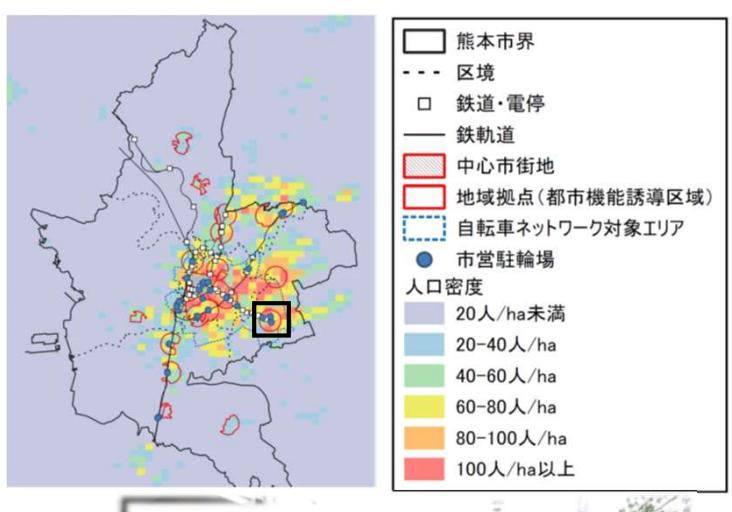

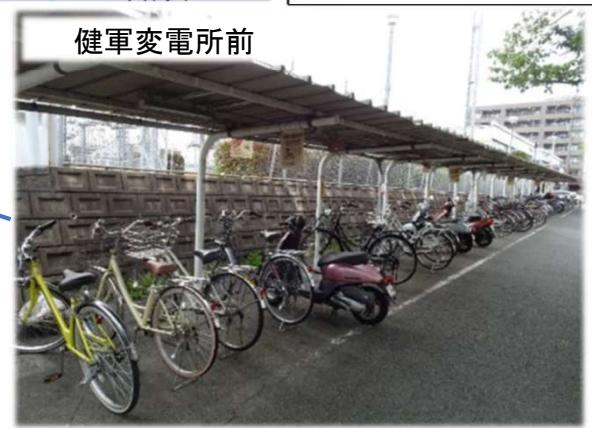

1㎞圏内の高校数 1校

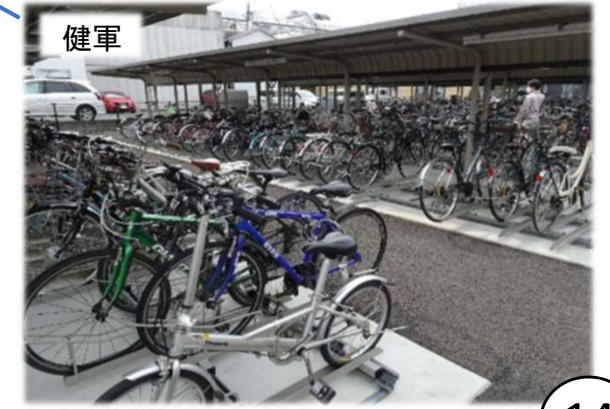

1㎞圏内の高校数 1校

# 5. 「駐輪環境の整備・構築」に向けて

【熊本市自転車活用推進計画(R3.3)より】

| 施策            | 取組                      |
|---------------|-------------------------|
| 1. 自転車走行空間の整備 | ①自転車走行空間の整備             |
|               | ②交通事故危険箇所における事故防止対策     |
|               | ③自転車ネットワークの拡充           |
| 2. 駐輪環境の整備・構築 | ①交通結節点等における駐輪場整備        |
|               | ②放置自転車ゼロ作戦              |
|               | ③駐輪場整備補助の導入             |
|               | ④駐輪場の有料化・料金体系の見直し       |
|               | ⑤駐輪場設備の拡充および施設の更新       |
|               | ⑥駐輪場のICカードへの対応化         |
| 3. 自転車通勤の促進   | ①熊本市版「自転車通勤推進企業」認定制度の導入 |
|               | ②サイクル&ライドの促進            |

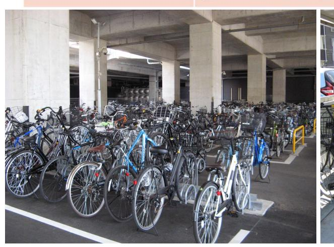

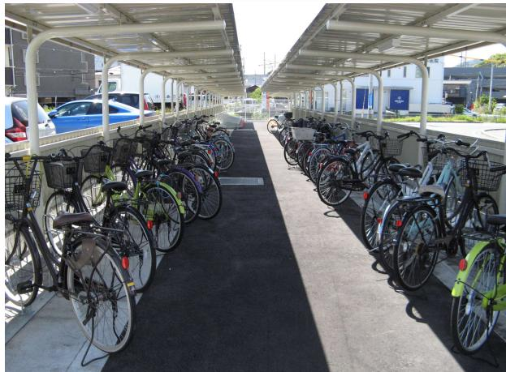

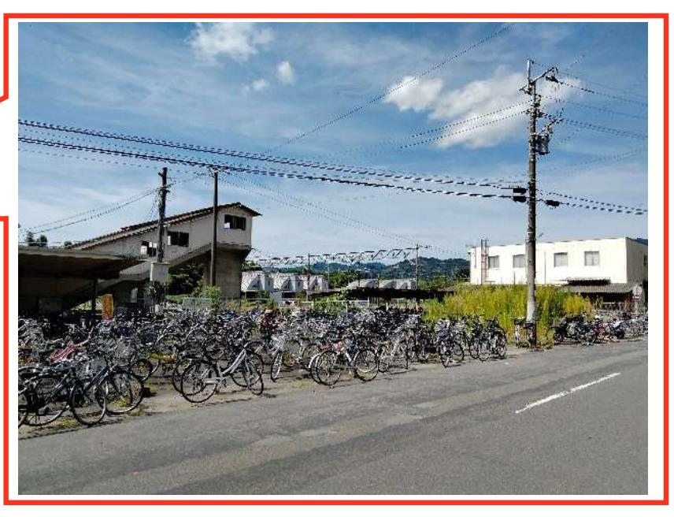

令和3年度の駐輪場整備は、植木駅の新設 と西熊本駅の増設を予定

本年度の調査結果を参考にして、来年度 以降、優先順位を付けながら駐輪場サー ビスの充実を図っていく。